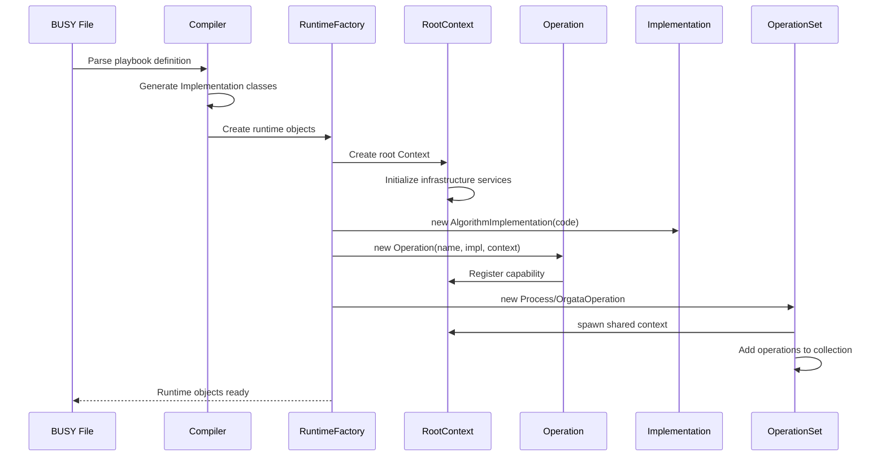
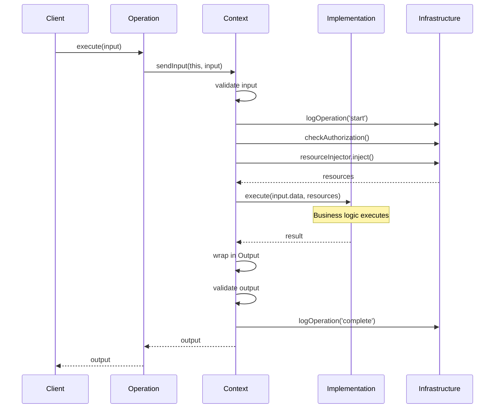
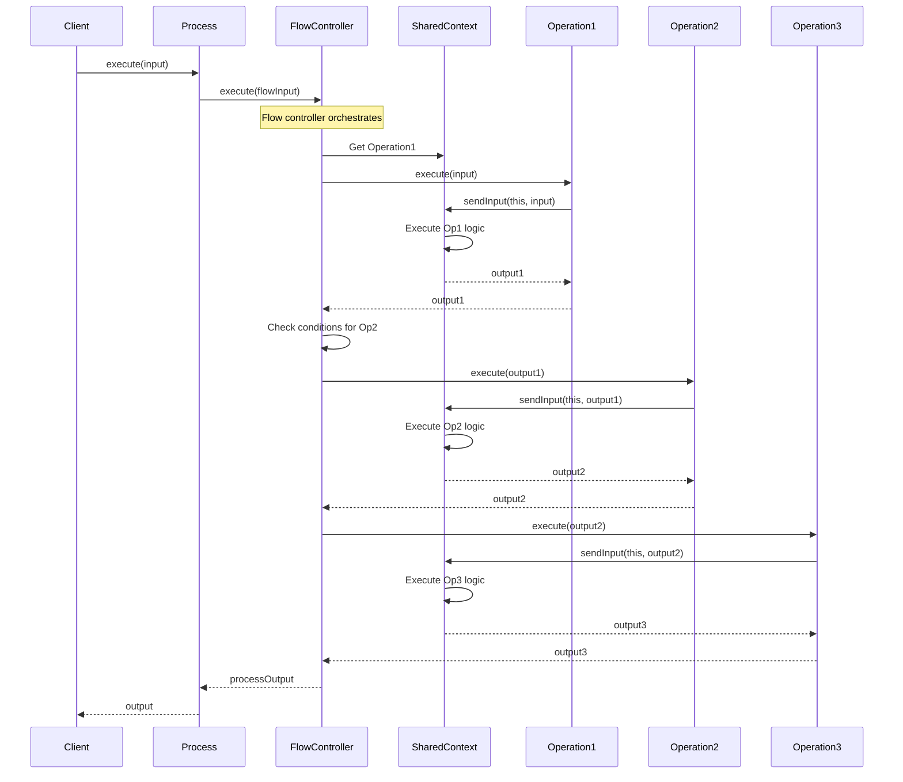
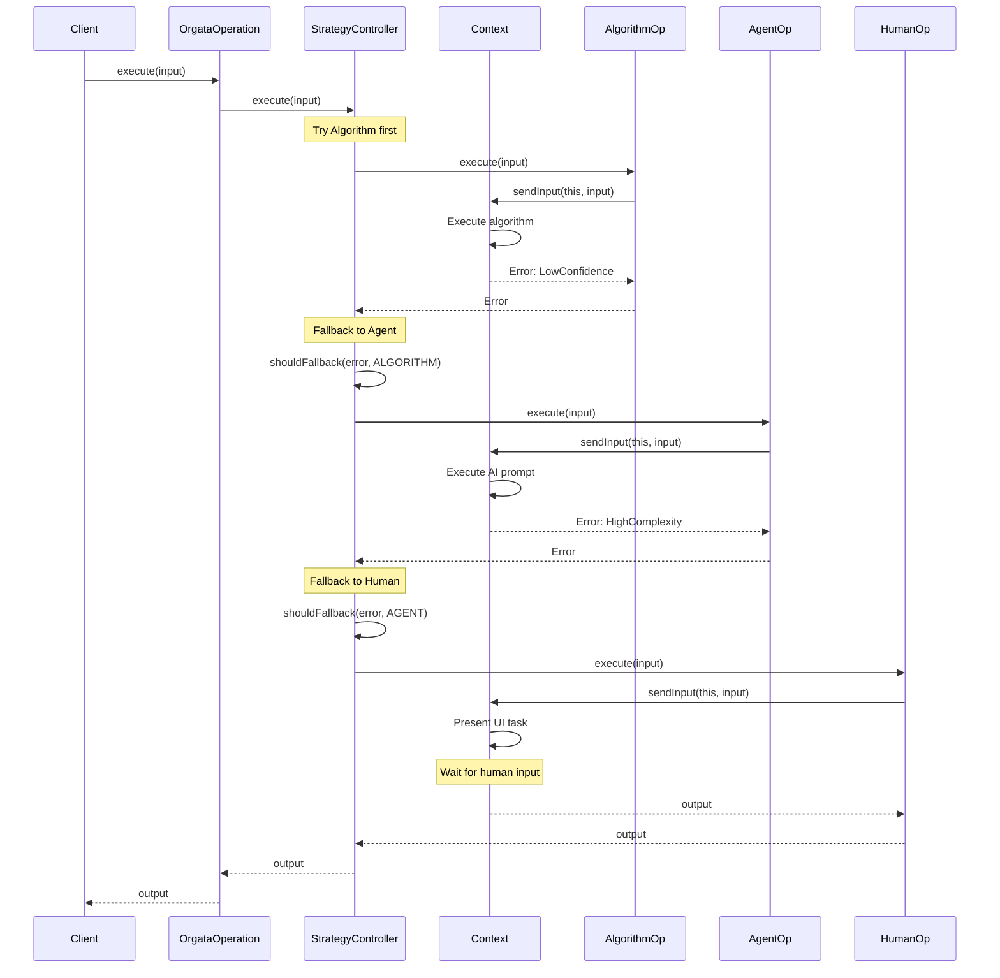
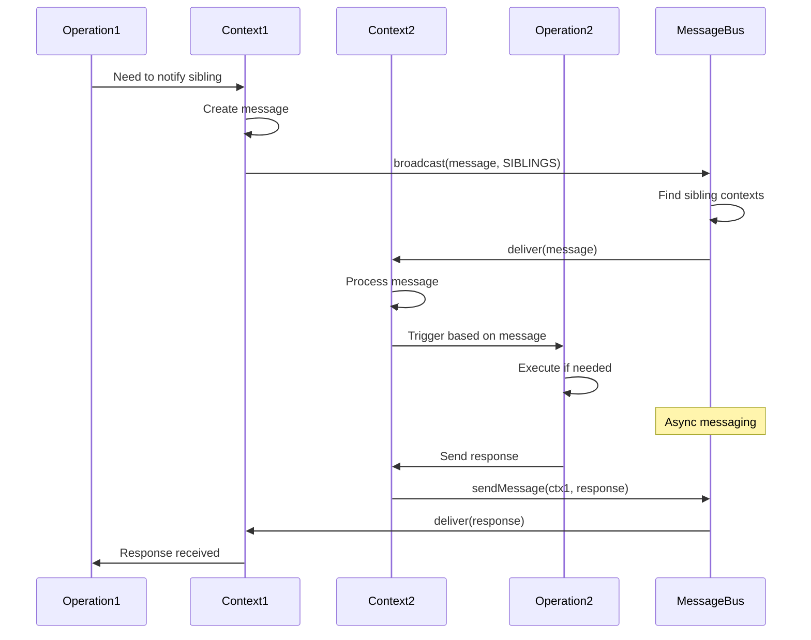
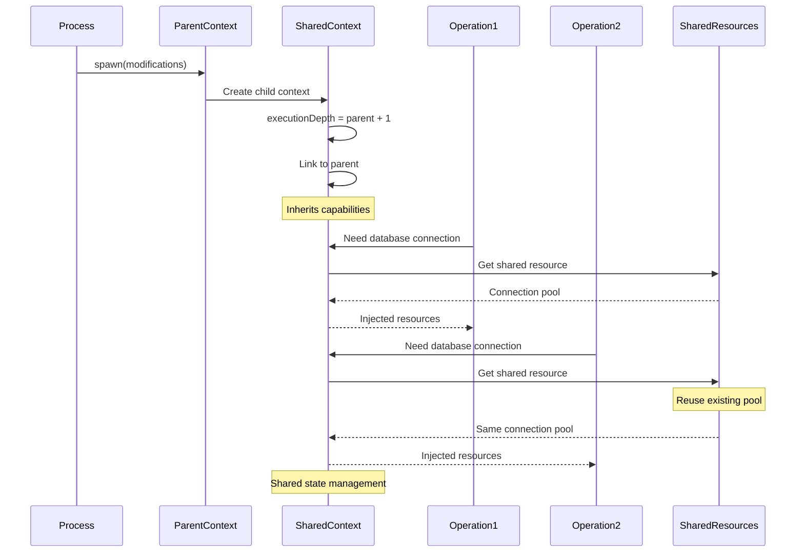
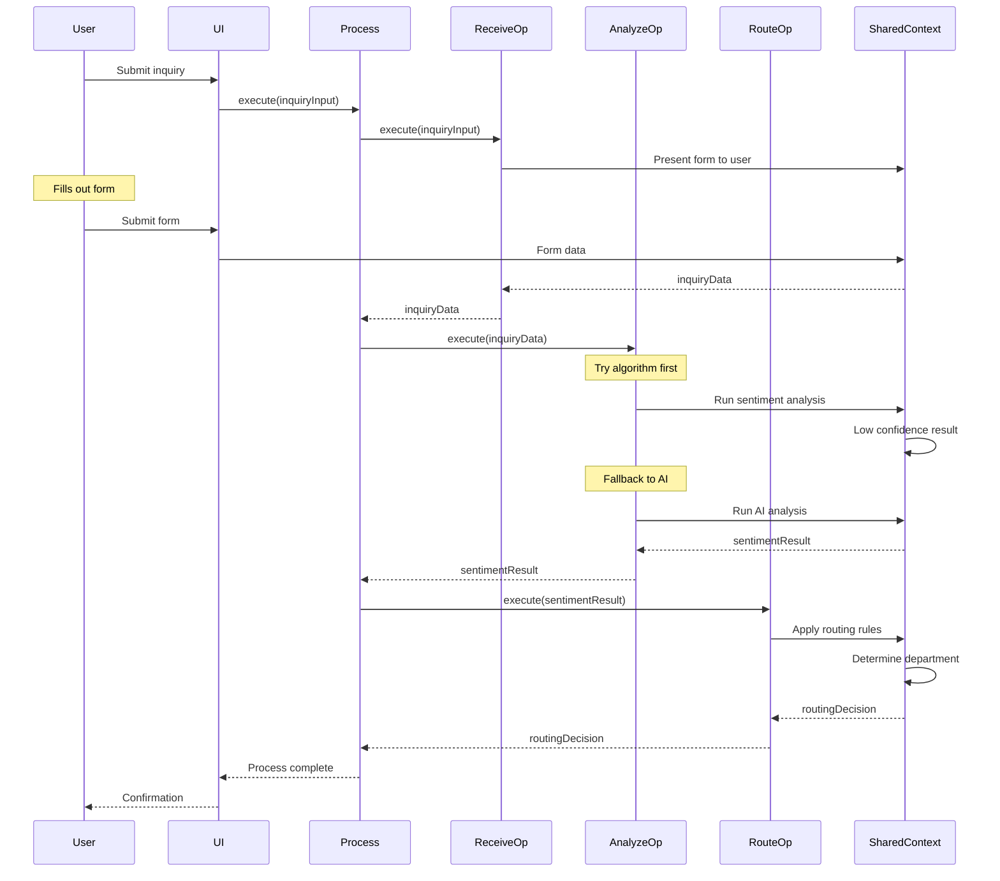

# Orgata Framework - Sequence Diagrams

This document illustrates key execution flows in the Orgata runtime framework, showing how compiled BUSY specifications wire together and execute.

## 1. BUSY Compilation to Runtime Objects



## 2. Simple Operation Execution



## 3. Process Execution with Multiple Steps



## 4. OrgataOperation with Mode Fallback



## 5. Context Messaging Between Operations



## 6. Context Spawning and Resource Sharing



## 7. Complete Business Process Example

This shows a customer inquiry process from BUSY spec to execution:

```yaml
# BUSY specification
playbook:
  name: "handle-customer-inquiry"
  steps:
    - name: "receive-inquiry"
      execution_type: "human"
    - name: "analyze-sentiment"
      execution_strategy:
        modes: ["algorithm", "agent"]
    - name: "route-to-department"
      execution_type: "algorithm"
```



## Key Insights from Sequence Diagrams

1. **Context as Orchestrator**: Context handles all the complexity of execution, validation, resource injection, and messaging

2. **Clean Separation**: Operations don't know about infrastructure - they just receive injected resources

3. **Flexible Composition**: Process and OrgataOperation are just specialized OperationSets with control operations

4. **Unified Execution Model**: Everything goes through Context.sendInput(), providing consistent behavior

5. **Resource Efficiency**: Shared contexts enable resource pooling while maintaining isolation where needed

6. **Natural Fallback**: Strategy pattern is just another Operation that coordinates other Operations

The architecture enables business logic to remain simple while the framework handles all the complexity of distributed execution, error handling, and resource management.